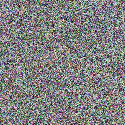

# T-Rex effect

It's vision is based on movement!

Inspired by this [video](https://www.youtube.com/watch?v=RNhiT-SmR1Q).

## Explanation

This effect is based on the idea that the human eye is more sensitive to changes in light intensity than to constant light. By flipping pixels of a noise pattern using a mask, we can create the illusion of the shape. If you stop the animation, the shape disappears into noise.

